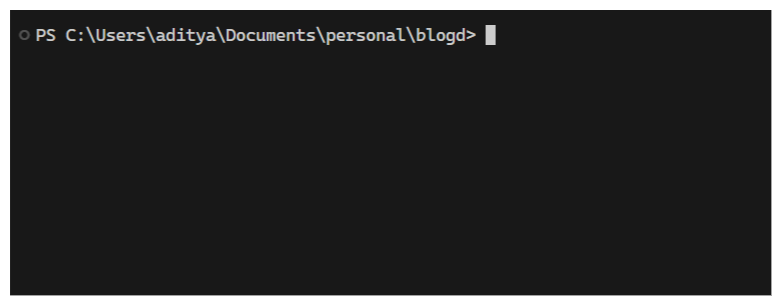

# Customize PowerShell Prompt with Git and Salesforce Info
`July 27, 2025`

By default, the PowerShell prompt just shows the full path to the current directory — nothing fancy.




But,


yeah! 
That's name of current directory, followed by current Git branch, followed by default sf org alias!

Now i know, i know, why do all this! But it is so beautiful! and why only let Arch have all the fun! 
So, let's see how to do this -

### 1. Edit $PROFILE
Run the following command to open $PROFILE in vscode,
```bash
code $PROFILE
```

### SIDE NOTE:
$PROFILE is an env variable to a powershell script. It is used to set what appears as prompt in your shell.

### 2. Create prompt
Paste the following code in the opened file,
```PowerShell
function prompt {
    # Print current directory name only, instead of full path
    $dirName = Split-Path -Leaf (Get-Location)
    Write-Host -NoNewline $dirName -ForegroundColor Blue

    # one whitespace after folder
    Write-Host -NoNewline " "

    # Print current git branch if any
    try {
        $branch = git rev-parse --abbrev-ref HEAD
        
        if ($branch) {
            Write-Host -NoNewline " $branch " -ForegroundColor Black -BackgroundColor Green

        }
    } catch {}

    # Print default sf org if any
    try {
        $org = (Get-Content -Raw ./.sf/config.json | ConvertFrom-Json).'target-org'
        
        if ($org) {
            Write-Host -NoNewline " $org " -ForegroundColor Black -BackgroundColor Blue

        }
    } catch {}

    if ($branch -or $org) {
        # one whitespace after last element with background color
        Write-Host -NoNewline " "
    }

    return "> "
}
```

### That's it, Enjoy!
Open a terminal, see your new prompt in action. 

Not loving it? No problem. Just open your $PROFILE again (see step 1) and clear it. Or better, customize it to your liking!

Happy Tweaking! 🎨

